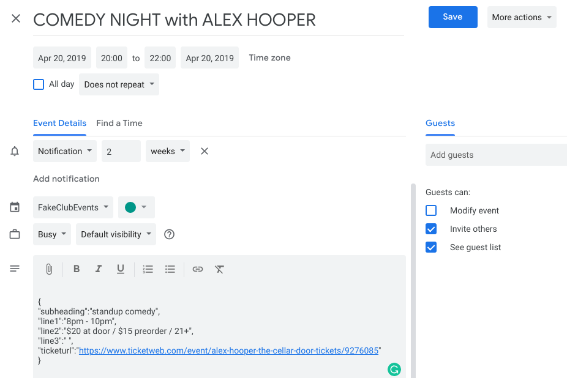

## Calendar Events Netlify function

**calendar-events** is a netlify function that uses the google calendar api to return event information entered into a google calendar.

### Usage

To run in a local environmet:

Clone this repository

`$ git clone https://github.com/pahosler/calendar-event.git`

then

```
$ cd calendar-events
$ yarn
```
Create/edit a .env file in the projects root directory. Please refer to the [Environment variables example](#environment-variables).

Once the environment variables are saved,

```
$ yarn start:lambda
```

The function will be available at:

`http://localhost:9000/.netlify/functions/calendar-events?maxEvents=3`

## Example Javascript Usage With < fetch >

```javascript
const URI = "https://site-where-installed.netlify.com/.netlify/functions/calendar-events?maxEvents=3";

const getCalendar=()=>{
  loading.innerHTML=`<h1 class="loading">Loading...</h1>`
  fetch(URI, {
    method: "POST",
  })
    .then(response => response.json())
    .then(json => {
      console.log(json.events)
    })
    .catch(err=>{console.log("error:",err,"calendar data is probably formatted incorrectly")})
};
```

It is also possilble to get a specific date:

` https://site-where-installed.netlify.com/.netlify/functions/calendar-events?date=2019-04-28`

If there are no events for a specific date, the api will return `events: "none"`

Or you can specify a date with maxEvents to get a list of events from a specific date:

` https://site-where-installed.netlify.com/.netlify/functions/calendar-events?date=2019-04-20&maxEvents=3`

### Data returned from the endpoint
The calendar-events endpoint returns:
- start: event.start.dateTime (or .date for all day events)
- end: event.end.dateTime (or .date for all day events)
- summary: event.summary (Title)
- description: event.description
- id: event.id
- status: event.status
- iCalUID: event.iCalUID
- htmlLink: event.htmlLink
- extendedProperties: event.extendedProperties

More calendar data could easily be added, but the above is sufficient for the intended use case.

I recommend entering the calender data as stringified json, for example:

*this recomendation will change, the api will eventually also write data, and store things like URLs and event information in extendedProperties.private or extendedProperties.shared.*



```json
{
  "subheading":"standup comedy",
  "line1":"8pm - 10pm",
  "line2":"$20 at door / $15 preorder / 21+",
  "line3":" ",
  "ticketurl":"https://www.ticketweb.com/event/alex-hooper-the-cellar-door-tickets/9276085"
}
```

This will make parsing and using the data much easier, and keeps it in an expected format for use in a webpage.


[Example on codepen.io](https://codepen.io/pahosler/pen/JVZqjv?editors=0101)

### Local Set-up

- clone this repository
- yarn
- yarn add netlify-cli or globally npm i -g netlify-cli
- netlify init
- (you probably won't need this after init) netlify link --name ***your-site-name*** or netlify link --id 123-123-123-123
- **STOP** go configure netlify in your site settings


### Netlify Set-up

the following is assuming you have an existing site

- navigate to your sites netlify settings page
- select Functions
- edit deploy settings directory `./functions` is what you will want to enter for your Functions directory
- Navigate to Build & Deploy Environment variables
- Edit variables and enter the following (this must be done manually)
## Environment Variables
| **Environment variables**    | **Values** |
|:---|---|
| **ACCESS_TOKEN**    | enter value from token.json ex. `ya29.GlvrBnCImILDrwAjzMq2rkvxE6Fx8StL9SnTCSgskSAdQnfTXrtybNeEYU574gsHayAevmLCgfA4QduUHdRh94MIGcJsp7boT_XrkxcdcK_DgRZAIA7TtBPZxopl` |
| **CALENDAR_ID**     | enter value obtained from google calendar settings or enter `primary` |
| **CLIENT_ID**       | enter value from credentials.json |
| **CLIENT_SECRET**   | enter value from credentials.json |
| **EXPIRY_DATE**     | enter value from token.json |
| **MAX_RESULTS**     | enter the max number of calendar results you expect to receive |
| **REDIRECT_URI**    | enter value from credentials.json |
| **REFRESH_TOKEN**   | enter value from token.json |


### Deploying from local dev environment

Edit your netlify.toml file, reveiw the one from this repository.
If deploying from your local dev you will need to edit the netlify.toml file

Do not deploy before adding/editing the environment variables in the netlify UI.

If you do, you will have to repeat the next steps. Netlify **only** reads them once for your functions and will not update on changes made after you deploy.

The easiest way to deploy is to edit the settings in the UI to automatically build on PRs to your repo

Skip this if you automatically build on PR to github:

If there is already a functions folder and you've edited anything, even the toml `$ rm -r functions`
- `$ netlify functions:build --src src/lambda`
- `$ netlfiy deploy --prod`


If there are errors, please file an issue.
